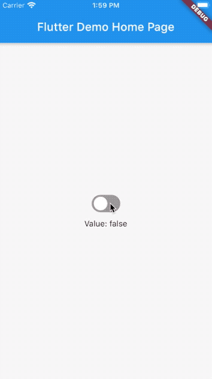

# simple_switch

A simple yet customizable and lightweight switch widget.

## Demo



## Setup

### 1. Depend on it

Add this to your package's pubspec.yaml file:

```yaml
dependencies:
simple_switch: ^1.0.0
```

### 2. Install it

You can install packages from the command line:

with Flutter:

```
$ flutter pub get
```

Alternatively, your editor might support flutter pub get. Check the docs for your editor to learn more.

### 3. Import it

Now in your Dart code, you can use:

```dart
import 'package:simple_switch/simple_switch.dart';
```

## Usage

Basic usage

```dart
SimpleSwitch(
    value: _isToggled,
    onChanged: (value) {
        setState(() {
            _isToggled = value;
        });
    },
),
```

Customize

```dart
SimpleSwitch(
    value: _isItem1Toggled,
    activeColor: Colors.blue,
    inactiveColor: Colors.grey,
    size: 25,
    width: 50,
    height: 50,
    borderRadius: 25,
    curve: Curves.easeInOutCubic,
    duration: Duration(milliseconds: 100),
    value: _isToggled,
    onChanged: (value) {
        setState(() {
            _isToggled = value;
        });
    },
),
```

## Testing

Please refer to [example/test/widget_test.dart](https://github.com/joshuadeguzman/simple_switch/blob/master/example/test/widget_test.dart) on how to add widget tests when using `SimpleSwitch`.

Example:

```dart
testWidgets('user has toggled the SimpleSwitch to true',
    (WidgetTester tester) async {
    await tester.pumpWidget(MyApp());

    await tester.tap(find.byType(SimpleSwitch));

    await tester.pump(Duration(milliseconds: 200));

    final valueToggled = find.text("Value: true");

    expect(valueToggled, findsOneWidget);
});
```
